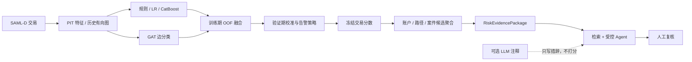

# AML Evidence Graph

[](https://github.com/juhaoyang666-hash/aml_evidence_graph/actions/workflows/ci.yml)
[](https://github.com/juhaoyang666-hash/aml_evidence_graph/releases)

面向风控、反欺诈、图算法与大模型风控应用岗位的 AML 求职项目。项目在公开合成
[SAML-D](https://www.kaggle.com/datasets/berkanoztas/synthetic-transaction-monitoring-dataset-aml)
约 950 万笔交易上完成交易级风险排序，并将账户、资金路径和案件候选作为冻结交易分数的
后评分聚合；LLM 只辅助调查措辞，不参与风险分数、阈值、告警排序或案件结论。

当前版本：[求职发布版 v1.0.0](https://github.com/juhaoyang666-hash/aml_evidence_graph/releases/tag/v1.0.0-resume)。
投递前 P0/P1 工程项已经闭环，完整状态见[项目改进进度](docs/项目改进进度.md)。

## 项目亮点

- **无未来泄漏**：固定时间外切分；每笔交易只使用 `[t-window,t)` 历史，同时间戳交易先评分再入历史。
- **极不平衡评估**：以 PR-AUC 和 0.1%/0.5%/1% 告警预算为主，补充 Bootstrap、漂移和风险切片。
- **历史图边分类**：同协议比较 GraphSAGE、GAT、RGCN、PNA；在最优 GAT 上继续迭代时点新颖性。
- **可审计融合**：只用训练期 expanding-time OOF 拟合融合器，验证期校准与锁定阈值，测试只披露。
- **受控调查链**：RiskEvidencePackage、白名单工具、Typology 检索、事实校验、人工审批与独立审计。
- **工程闭环**：Spark PIT 等价、MLflow candidate gate、FastAPI、Docker、结构化日志、CI 和 144 项测试。

## 两分钟 Mock Demo

不需要完整数据、GPU、密钥或外部 LLM。Docker 镜像只复制代码、配置和 Typology，不复制
`data/`、`artifacts/` 或模型权重，并使用清华 PyPI 镜像安装依赖。

```bash
git clone https://github.com/juhaoyang666-hash/aml_evidence_graph.git
cd aml_evidence_graph
docker compose -f docker-compose.demo.yml up --build --wait
```

打开 <http://127.0.0.1:8000/demo>，点击“加载 Mock 调查草稿”。演示会展示：

1. 虚构 Evidence Package 与数据边界；
2. 规则、特征、图边和 Typology 的证据引用；
3. 确定性事实摘要、待核实问题和 SAR 草稿骨架；
4. `draft_requires_human_review` 停点，而不是自动申报或案件处置。

```bash
# 查看健康状态并停止
docker compose -f docker-compose.demo.yml ps
docker compose -f docker-compose.demo.yml down

# 已安装 Python 依赖时，可直接运行同一套六项发布断言
python scripts/operations/verify_resume_release.py
```

Mock 分数和页面内容只用于工程演示，不能当作 SAML-D 指标或真实业务结论。

## 系统边界



监督目标是交易边标签。账户风险、资金路径和案件视图由交易结果聚合产生，不把交易标签直接
转换成账户标签。普通 ODPS 笛卡尔积被禁止；批式实现使用预聚合和显式等值连接。

## 当前主线结果

协议：训练 2022-10～2023-04、验证 2023-05～06、测试 2023-07～08；测试集
1,558,821 笔、正例 1,813，正例率约 0.116%。数据为公开合成 SAML-D。本机完成的冻结测试
与同协议 OOF 产物作为当前公开主线；历史 v1 和未晋升实验保留在实验文档中用于对照。

| 模型 | 环境 / 角色 | 测试 PR-AUC | 0.1% 告警预算证据 | 当前状态 |
|---|---|---:|---|---|
| **GAT + 时点新颖性** | **主线图排序器** | **0.9714** | P/R `0.9814 / 0.8439` | 冻结时间外测试；峰值排序模型 |
| **CatBoost FE v2 + GAT v1** | **OOF 融合策略** | **0.9505** | P/R `0.9737 / 0.8373` | 展示 stacking/校准；低于单 GAT |
| **CatBoost FE v2** | **主线表格模型** | **0.8754** | P/R `0.8999 / 0.7739` | 相对 CatBoost v1 提升 `+0.0662` |
| Logistic Regression | 线性表格对照 | 0.1966 | P/R `0.2809 / 0.2416` | 保留 v1 同协议基线 |
| 规则 v2026.2 | 业务基线 | 0.0015 | P/R `0.0019 / 0.0017` | 训练期定阈规则 |

CatBoost 在 50% 召回下相对训练期定阈规则减少约 99.86% 告警。必须同时披露：当前融合
使用的是本机重训 GAT v1，而不是时点新颖性 GAT，且**低于主线单 GAT**；`graph_stats`、
度数交互和三路融合只作合成机制对照，不进入主线。run_id、Bootstrap 和切片见[实验结果](docs/实验结果.md)与
[简历证据](docs/简历证据.md)。

时点新颖性相对本机 v1 replay 的 PR-AUC 点差为 `+0.01922`，200 次配对 Bootstrap 95% CI
`[+0.01152,+0.02798]`；部分已见账户与 Smurfing 切片退化，因此对外必须限定为合成数据上的
时点特征收益。度数交互的异常高分按 SAML-D 生成机制捷径处理，不包装为业务收益。详见
[FE v2 实验](docs/特征工程V2实验.md)和[GAT 工程实验](docs/GAT工程Pareto实验.md)。

GraphSAGE `0.8777` 不再占用当前主线表位置；它与 RGCN、PNA 一并保留在
[实验结果](docs/实验结果.md)的历史同协议架构对照中。
补充的 validation-only 双 seed 矩阵显示，时点新颖性可将 GraphSAGE FE v2 从
`0.54478 / 0.69682` 提升到 `0.90171 / 0.93154`，但仍低于同 seed GAT
`0.94539 / 0.94686`；因此未读取 GraphSAGE 新测试集，也不改变 GAT 主线。

## 调查、检索与 Agent 证据

| 能力 | 当前证据 | 边界 |
|---|---|---|
| 生成 Golden | 34 案；Schema/事实快照、幻觉拦截、无证据拒答均通过 | 项目裁定，不是第三方专家面板 |
| Typology 检索 | 11 篇语料、130 条开发评测；另有 50 条项目盲法集 | 检索只给调查线索，不参与评分 |
| Answerability gate | 项目盲法集无答案误召回率 60.0% → 13.3%，Recall@3 保持 75.7% | 裁定者参与开发，不是独立合规验收 |
| 受控 Agent | 60 案路由/工具/审核/恢复回归五项指标均为 1.0 | 确定性无 LLM 基线 |
| Human-in-the-loop | checkpoint、approve/edit/reject、幂等键、两 worker 租约续期与 fencing | 单机 SQLite 原型，不是跨主机高可用 |

外部 LLM 只接收最小化后的证据类别和引用元信息；返回内容必须通过引用白名单及数字/实体校验，
失败时回退确定性模板。详见[大模型调查系统](docs/大模型调查系统.md)、
[检索评估](docs/检索评估.md)和[Golden 数据说明](golden/README.md)。

## 工程证据

- Spark `local[8]` 在 9,504,852 行上重放 5 个代表性 PIT 特征，完整/增量逐交易 match rate
  均为 `1.0`；窗口严格为 `[t-window,t)`。
- MLflow 记录 v1/FE v2 的 CatBoost、GAT、融合三组同协议 candidate；选型 gate 只读取 validation，
  测试指标标记为不可用于选择。
- DuckDB/Polars 代表性窗口特征与官方 PIT match rate 均为 `1.0`。
- FastAPI 支持 Mock 演示、受控本地评分、调查、人审恢复和结构化审计；完整融合 HTTP 基准与
  单机两 worker 争用边界均有记录。
- 当前融合与 GAT + 时点新颖性均已生成独立版本的账户、资金路径和案件候选视图；这些是
  冻结交易分数后的无标签聚合，不是账户监督标签或新增模型指标。
- GitHub Actions 执行依赖检查、Ruff、实验脚本入口、144 项测试、Golden smoke 和发布 smoke。

详情见[批量特征重放](docs/批量特征重放.md)、[服务性能基准](docs/服务性能基准.md)和
[项目改进进度](docs/项目改进进度.md)。

## 安装与验证

Python `>=3.11,<3.14`。CPU/Mock 环境不需要安装 PyTorch；图训练请按目标 CUDA 版本单独安装
GPU PyTorch 和 PyG wheels。

```bash
python -m venv .venv
# Linux/macOS: source .venv/bin/activate
# Windows PowerShell: .venv\Scripts\Activate.ps1
python -m pip install -i https://pypi.tuna.tsinghua.edu.cn/simple ".[dev,llm]"

python scripts/operations/verify_resume_release.py
python -m ruff check src tests scripts
python -m pytest
aml-api  # http://127.0.0.1:8000/demo
```

完整训练需要 GPU 和本地 SAML-D 文件，正式命令、CUDA/Java/Spark 环境与产物路径见
[环境配置](docs/环境配置.md)。公开仓库不包含完整数据和训练产物。

## 仓库结构

```text
configs/                  规则、模型、Prompt、检索与评测配置
golden/                   Mock、生成、检索与 Agent 回归集合
knowledge/typologies/     版本化 Typology 语料
scripts/                  按 data/experiments/retrieval/reporting/operations/pipelines 分类的入口
sql/                      ODPS/Hive 风格 PIT 模板（禁止普通笛卡尔积）
src/aml_evidence_graph/   数据、特征、训练、聚合、调查与 API 实现
tests/                    按 api/data/features/models/investigation/evaluation/engineering 分类的回归
docs/                     权威结果、模型卡、实验和求职材料
```

## 文档入口

| 文档 | 用途 |
|---|---|
| [文档索引](docs/README.md) | 全部长期维护文档及维护规则 |
| [项目改进进度](docs/项目改进进度.md) | P0/P1 完成度、已关闭事项与剩余边界 |
| [实验结果](docs/实验结果.md) | 主线、Bootstrap、架构对比、漂移和负结果 |
| [模型卡](docs/模型卡.md) | 适用范围、切分、限制和披露要求 |
| [简历证据](docs/简历证据.md) | 自动门禁生成的唯一公开指标证据页 |
| [主架构图](docs/主架构图.md) | 风险评分、后评分聚合、Agent 和人审边界 |
| [面试要点](docs/面试要点.md) | 简历项目描述、项目介绍和高频追问 |

## 必须披露的限制

- 所有效果数字来自公开合成 SAML-D，不能外推为真实银行生产效果。
- 项目没有真实线上流量、标签延迟验证、公司级 Spark/Hive 调度或在线特征存储。
- Golden 和项目盲法检索集不是独立第三方合规专家验收。
- SQLite checkpoint/audit/lease 适合单机演示，不等于生产 WORM、跨主机一致性或灾备。
- LLM 不提高风险识别率，也不替代调查员或合规审批。
