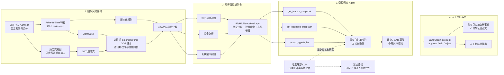

# AML Evidence Graph 主架构

> 边界：风险分数只由规则和冻结机器学习模型产生；LLM/Agent 只读证据包，
> 不参与特征、模型分数、融合、阈值或案件结论。

## 数据与控制边界

| 边界 | 保证 |
|---|---|
| 时间 | PIT 特征和图邻居严格只读事件时点之前的历史 |
| 模型选择 | OOF 拟合，验证期校准/锁阈，测试期只做冻结评估 |
| 聚合 | 账户、路径、案件是交易分数的后评分聚合，不回灌为监督标签 |
| Agent | 只调用三个参数受限的只读工具，输出须通过事实校验 |
| 决策 | 人工审批前不产生最终调查结论或监管申报决定 |
| LLM | 不参与风险分数、融合权重、阈值或案件结论 |

实现与评估细节见 [模型卡](模型卡.md)、[关联案件工作流](关联案件工作流.md)、
[大模型调查系统](大模型调查系统.md)。
