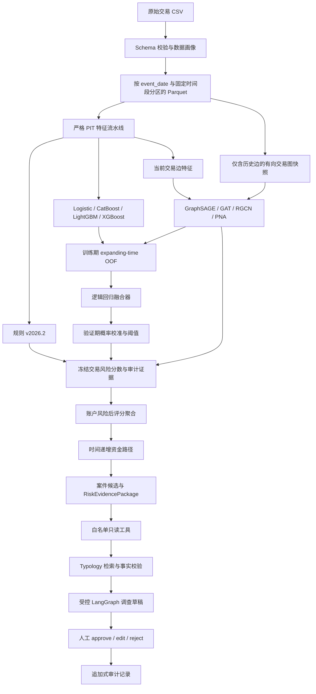

# AML Evidence Graph 项目技术路线与效果详解

> 更新日期：2026-08-11  
> 文档定位：面向项目维护者和面试准备的端到端技术导读。指标以
> [简历证据.md](简历证据.md) 的发布门禁为准，完整实验细节以
> [实验结果.md](实验结果.md) 和 [模型卡.md](模型卡.md) 为准。

## 一、先用五分钟理解项目

这个项目解决的不是“给账户贴洗钱标签”，而是一个更严格的三段式问题：

1. **交易风险排序**：对每笔交易边输出风险概率，监督目标是交易级 `is_laundering`。
2. **调查对象构建**：在交易分数冻结后，以确定性逻辑聚合账户风险、资金路径和案件候选。
3. **调查辅助**：将模型、规则、特征和图证据封装为 `RiskEvidencePackage`，由受控
   LangGraph 工作流生成调查草稿，最后必须经过人工审批。

项目最重要的设计不是某个单一模型，而是以下四个约束同时成立：

- 每个历史特征只读取交易时点之前的 `[t-window, t)` 数据；
- 图模型只在历史边上传播消息，测试标签和未来边不会进入图；
- 融合器只使用训练期 OOF 分数，校准和阈值只使用验证期；
- LLM 不参与风险评分、阈值、排序或案件结论。

当前冻结测试集包含 1,558,821 笔交易、1,813 个正例，正例率约 `0.116%`。主线效果为：

| 模型 | 定位 | 测试 PR-AUC | 0.1% 告警预算 Precision / Recall |
|---|---|---:|---:|
| 规则 v2026.2 | 可审计业务基线 | 0.0015 | 0.0019 / 0.0017 |
| Logistic Regression | 线性表格对照 | 0.1966 | 0.2809 / 0.2416 |
| **LightGBM FE v2** | **主线表格模型** | **0.9014** | **0.9403 / 0.8086** |
| CatBoost FE v2 | 历史表格对照 | 0.8754 | 0.8999 / 0.7739 |
| XGBoost FE v2 | 表格对照 | 0.8969 | 0.9359 / 0.8047 |
| **GAT + 时点新颖性** | **主线图排序器** | **0.9714** | **0.9814 / 0.8439** |
| LightGBM FE v2 + 本机 GAT v1 | OOF 融合工程证据 | 0.9561 | 0.9827 / 0.8450 |

应先记住两个结论：

- 当前峰值排序模型是 **GAT + 时点新颖性**，不是融合模型。
- `0.9561` 的融合使用 LightGBM FE v2 和本机 **GAT v1 replay**，并没有使用最新的新颖性
  checkpoint，因此不能称为“两个最新主模型的融合”。
- LightGBM 已补齐 OOF、融合、解释、持久化和服务加载，正式替换 CatBoost 为表格主线；
  CatBoost 只作为历史模型族对照与旧产物兼容路径保留。

## 二、问题定义与职责边界

### 2.1 输入、标签和输出

当前仓库可复现的数据源是公开合成 SAML-D，约 950 万笔交易。输入经过统一契约后包含：

- 交易标识与事件时间；
- 付款方、收款方账户标识；
- 金额、付款币种、收款币种；
- 付款方与收款方地域；
- 支付方式；
- 交易级监督标签 `is_laundering`；
- 仅用于评估切片的 `laundering_type`。

`is_laundering` 只进入训练损失和离线评估，`laundering_type` 只进入切片分析；两者均禁止作为
模型特征。详细字段映射见 [数据字典.md](数据字典.md)。

系统输出分为四层：

| 层级 | 输出 | 是否是监督标签 |
|---|---|---|
| 交易层 | 风险概率、告警排序、规则证据 | 交易标签只用于训练和评估 |
| 账户层 | 窗口内高风险交易聚合 | 否，不是账户洗钱标签 |
| 关系层 | 时间递增资金路径、关键边和关联子图 | 否，是调查线索 |
| 案件层 | `investigation_candidate` 与调查草稿 | 否，最终结论由人工给出 |

### 2.2 系统明确不做什么

- 不把任一高风险交易直接转换为“账户已洗钱”；
- 不把图社区直接称为团伙或案件事实；
- 不让 LLM 修改模型概率、阈值和告警顺序；
- 不把合成数据离线效果包装成生产线上收益；
- 不把 Attention 权重解释成因果归因；
- 不把本机 SQLite 多进程验证描述为跨主机高可用或 WORM 审计。

## 三、端到端技术架构



评分、聚合和调查是三条代码路径。这样即使外部 LLM 超时、返回非法 JSON 或被事实门拒绝，交易
风险概率和告警排序也不会变化。

## 四、数据与时间协议

### 4.1 固定时间外切分

| 数据段 | 时间范围 | 用途 |
|---|---|---|
| 训练集 | 2022-10～2023-04 | 模型拟合、训练期规则定阈、OOF 折构造 |
| 验证集 | 2023-05～2023-06 | 早停、概率校准、阈值和候选选择 |
| 冻结测试集 | 2023-07～2023-08 | 最终一次性效果评估 |

随机切分会让同一账户的未来行为进入训练，因此本项目不用随机 train/test split。图模型、表格模型、
规则和融合均遵循同一时间协议，避免“模型提升”实际来自切分差异。

### 4.2 Point-in-Time 语义

对发生在时间 `t` 的交易，历史特征只能读取：

```text
[t - window, t)
```

右端点不包含 `t`。同一时间戳内的所有交易先共同评分，之后才一起进入滚动历史，因此同秒交易
相互不可见。这同时约束：

- 账户 1/7/30 日窗口；
- 付款方—收款方关系窗口；
- 历史图度数和往返关系；
- 图模型的历史边；
- 新账户和首次观察时间特征。

### 4.3 分区与批式迁移

原始 CSV 先转换成 `event_date=*` 分区 Parquet，PIT 特征也按日分区输出。权威 Python 管线之外，
项目还验证了三种批式重放：

| 实现 | 验证范围 | 结果 |
|---|---|---|
| DuckDB `RANGE` window | 代表性 7 日计数 | 与 PIT 逐行匹配率 1.0 |
| Polars rolling | 代表性 7 日计数 | 与 PIT 逐行匹配率 1.0 |
| Spark `local[8]` | 完整 9,504,852 行、5 个代表性特征 | 五项匹配率均 1.0 |

Spark 全量重放约 `71.29 s`，峰值进程树内存约 `12.1 GB`；增量 30 日历史扫描 885,238 行并输出
单日 8,400 行，约 `16.39 s`、峰值约 `2.9 GB`。这些结果证明 PIT 语义可以迁移到批式引擎，
不代表生产 Spark 集群 SLA。

对应数仓方案必须先按账户或账户对预聚合，再通过明确键回写交易粒度；ODPS、Spark、Hive SQL
一律使用显式等值连接，**禁止普通笛卡尔积**。

## 五、特征工程路线

### 5.1 当前交易特征

当前边本身可用的信息包括：

- `log1p(amount)`、币种转换标志；
- 付款方/收款方地域及跨境标志；
- 支付方式、现金类支付和跨境支付方式；
- 小时、星期、周末；
- 整额、接近训练期报告阈值等金额形态。

这些字段在交易到达时即可获得，不依赖未来信息。

### 5.2 账户与关系历史窗口

对 sender outgoing、receiver incoming 和 sender-receiver relationship 分别构建 1/7/30 日：

- 交易次数；
- 同币种金额和；
- 唯一对手方数；
- 跨境交易次数。

FE v2 进一步加入短窗/长窗比率、当前金额相对 30 日均值的比率与 z-score、距上次收付的时间、
小额多对手方、现金流入后快速转出等行为模式代理。阈值配置位于
`configs/feature_engineering.yaml`，依赖分布的常量只允许由训练期确定。

### 5.3 因果图统计

在当前交易发生前维护：

- sender 历史入度、出度；
- receiver 历史入度、出度；
- 当前有向账户对的历史交易数；
- 反向边历史交易数；
- 是否已有互惠关系。

这些统计既可以进入表格模型，也用于解释 GNN 与表格模型之间的增量。它们不是把整张未来图
预聚合后回填，而是随时间单向更新。

### 5.4 时点新颖性

当前主线 GAT 的关键增量是端点新颖性：

- sender / receiver 是否首次出现；
- 距首次观察时间；
- 与可用历史长度相关的冷启动信号。

该特征族回答的是“这个账户或关系在当前时点对系统有多新”，不是“它在完整数据集中最终出现了
多少次”。相对本机 GAT v1 replay，冻结测试 PR-AUC 点差为 `+0.01922`，200 次配对
Bootstrap 的 95% 区间为 `[+0.01152, +0.02798]`。

项目曾发现最小度数交互在 SAML-D 上异常强，但进一步追溯表明它与合成数据生成机制存在结构捷径。
因此度数交互只保留为压力测试和负面教材，不进入主线。时点新颖性则经过双 seed、消融、配对
Bootstrap 和风险切片后保留。

### 5.5 规则特征的正确角色

规则阈值只从训练期统计量确定，命中结果有两种用途：

1. 作为独立、可解释的业务基线；
2. 作为模型特征和 `RiskEvidencePackage` 中的审计证据。

规则命中绝不作为监督标签，否则模型只是在拟合规则。规则版本更新若只改变阈值，可直接回填命中列，
实测 dry run 约 47 秒、完整写入约 2 分钟，不必重新执行约 8 小时的全量 PIT 构建。

## 六、模型路线

### 6.1 规则与表格模型

模型阶梯从简单到复杂：

1. 版本化规则：验证业务最低可用性和审计解释；
2. Logistic Regression：验证线性可分程度；
3. CatBoost、LightGBM、XGBoost FE v2：对比三类树模型的类别处理和非线性交互；
4. 历史图统计 + CatBoost：判断显式图统计能解释多少图模型收益；
5. GNN 边分类：学习显式聚合难覆盖的邻域结构。

类别不平衡处理只发生在训练阶段。表格主线使用稳定哈希采样/权重方案；测试集不做重采样。
hard-negative 重训曾使 CatBoost v1 测试 PR-AUC 从 `0.8092` 退化到 `0.4548`，因此作为负实验
留档，没有为了“方法更复杂”而晋升。

2026-08-11 又在完全相同的 FE v2 输入、时间切分、50 万训练负样本上限和 `graph_` 排除协议下
补充 LightGBM/XGBoost。类别词表只由训练期拟合，模型族内仅用验证 PR-AUC 选择复杂度：

| 模型 | 双 seed 验证 PR-AUC | 冻结测试 PR-AUC | 0.1% P / R |
|---|---:|---:|---:|
| CatBoost FE v2 | 0.8661 / — | 0.8754 | 0.8999 / 0.7739 |
| **LightGBM FE v2** | **0.8941 / 0.8953** | **0.9014** | **0.9403 / 0.8086** |
| XGBoost FE v2 | 0.8924 / 0.8910 | 0.8969 | 0.9359 / 0.8047 |

LightGBM 相对 CatBoost 的测试 PR-AUC 配对增益为 `+0.02599`，200 次 Bootstrap 95% CI
`[+0.02084,+0.03196]`；XGBoost 相对 CatBoost 为 `+0.02146`
`[+0.01562,+0.02726]`。LightGBM 进一步完成 4,524,912 条 expanding-time OOF、冻结融合、
训练期类别词表、模型持久化、全局 gain 重要性、局部 SHAP 和 FastAPI 加载，替换门禁已闭环。

### 6.2 有向时间交易图

图的定义为：

- 节点：账户；
- 有向边：付款账户到收款账户的一笔交易；
- 评分对象：当前交易边；
- 消息传播图：当前日之前、最多 30 天的历史交易边；
- 未见账户：映射到固定哈希桶，而不是用测试期账户重拟合节点词表。

`DailyGraphSnapshotBuilder` 按日生成快照。当前日边先形成 `scoring_edge_index`，历史队列只包含
更早日期的边；推理模式甚至不读取标签列。这样避免当前边或测试标签通过消息传播进入端点表示。

### 6.3 GAT 边分类器

当前 GAT 配置的核心参数为：

| 参数 | 值 |
|---|---:|
| 历史窗口 | 30 天 |
| GNN 层数 | 2 |
| 隐藏维度 | 64 |
| 邻居采样 | 15 / 10 |
| batch size | 2048 |
| dropout | 0.15 |
| 最大 epoch | 12 |
| 学习率 | 0.001 |

模型先在历史边上用 GATConv 更新账户 embedding，再对当前边组合：

```text
[sender_state,
 receiver_state,
 abs(sender_state - receiver_state),
 encoded_current_edge_features]
    → MLP → transaction logit
```

因此它不是只看账户 embedding，也不是只看当前交易特征，而是把历史邻域状态、端点差异和当前边
上下文联合用于边分类。

### 6.4 架构对照

历史同协议架构对照为：

| 架构 | 测试 PR-AUC | 结论 |
|---|---:|---|
| GAT v1 | 0.9483 | 历史主图模型 |
| RGCN 单关系 | 0.9031 | 低于 GAT |
| GraphSAGE v1 | 0.8777 | 早期图对照 |
| PNA | 0.7049 | 未晋升 |
| RGCN 四关系 | 0.8873 | 多关系划分没有带来收益 |

GraphSAGE FE v2 + 新颖性的双 seed 验证期实验说明新颖性收益不是 GAT 独有，但 GraphSAGE 仍低于
同 seed GAT，因此没有再次读取 GraphSAGE 测试集，也没有追加其 OOF/融合。这体现的是测试集访问
纪律，而不是实验未完成。

## 七、OOF 融合、校准与阈值

### 7.1 为什么不能直接用训练内预测融合

如果先在全部训练数据拟合 LightGBM/GAT，再用它们对同一训练数据的预测训练融合器，二层模型会
学习到过拟合分数。项目改用 expanding-time OOF：

```text
较早月份训练 → 预测下一月
扩大训练窗口 → 预测再下一月
……
拼接所有未见月预测 → 训练逻辑回归融合器
```

融合器的输入是训练期 OOF 概率；验证期只用于概率校准和告警阈值；测试期只执行冻结评估。

### 7.2 如何理解当前融合结果

当前 `0.9561` 的融合高于 LightGBM FE v2 的 `0.9014`，证明表格与图分数具有可融合的互补性；
但它低于 GAT + 时点新颖性的 `0.9714`。主要原因不是融合代码错误，而是当前融合组件是：

```text
LightGBM FE v2 + 本机 GAT v1 replay
```

它没有包含最新时点新颖性 checkpoint。即使在历史 v1 同协议中，CatBoost + GAT 的 PR-AUC
`0.9175` 也低于单 GAT 的 `0.9483`，且二者 Bootstrap 区间分离。因此本数据上的正确模型选择是：

- 峰值交易排序使用单 GAT + 时点新颖性；
- OOF 融合保留为无泄漏 stacking、校准和服务封装的工程证据；
- 不因为系统已经实现融合就强行将其设为主排序器。

## 八、评估体系与主要效果

### 8.1 为什么以 PR-AUC 为主

测试正例率只有约 `0.116%`。在这种极不平衡任务中，即使大量负例排序错误，ROC-AUC 仍可能非常
高，因此主指标是 PR-AUC，并同时报告：

- 0.1% / 0.5% / 1% 告警预算下 Precision、Recall；
- 固定 FPR 下 Recall；
- KS、Brier、ECE；
- 固定召回下告警量和每发现一例所需告警；
- 月度、Typology、新账户/低度账户切片；
- 配对 Bootstrap 置信区间；
- 延迟、内存和 GPU 占用。

所有排序指标输入连续概率，ROC-AUC 不使用阈值化标签。

### 8.2 表格与图模型带来的增益

LightGBM FE v2 的测试 PR-AUC 为 `0.9014`，相对 CatBoost FE v2 的 `0.8754` 提升
`+0.02599`。在匹配 50% Recall 时，表格主线相对规则基线将告警规模从约 64.9 万条压缩到
千条以内，削减约 `99.86%`。

GAT 的增益不仅来自已显式构建的 relationship 特征。在 0.1% 告警预算下，历史 GAT v1 找到
355 个 CatBoost 未命中的正例，而 CatBoost 独有正例为 173；这支持“历史邻域消息传播提供了
超出成对聚合的排序信息”，但仍是模型诊断，不是因果证明。

### 8.3 稳健性和风险切片

时点新颖性增益通过双 seed 和 200 次配对 Bootstrap 验证，但并非所有切片都同向：

- 新/低度账户切片与已见/高度账户切片差异明显；
- 部分已见账户和 Smurfing 切片存在退化；
- 60 日历史候选相对 30 日的点估计略高，但置信区间跨零，未晋升；
- FE v2 留一族消融显示节点统计、时序行为、关系特征的依赖程度不同；
- 单独去掉金额族在某次验证中没有退化，不能据此宣称金额特征无用。

这也是项目保留负实验的原因：模型选择依据是冻结协议、重复实验和切片，而不是只挑最高单点。

## 九、冻结分数后的调查对象构建

`aml-build-investigation-views` 只读取交易字段、规则命中和已冻结风险分数，不读取标签，也不训练。

### 9.1 账户风险

按明确 `as_of` 和历史窗口计算账户的最高/Top-N 交易风险、告警笔数和规则命中数。这个结果叫
`account_risk`，含义是“需要调查的账户视图”，不是账户监督标签。

### 9.2 资金路径

从高风险有向边中寻找时间严格递增的路径，保证后续边的时间晚于前序边。路径用于展示资金传播
上下文，不根据路径形态自动作洗钱结论。

### 9.3 案件候选

高风险边的弱连通子图形成 `investigation_candidate`。当前两套版本化视图为：

| 风险分数来源 | 账户数 | 资金路径 | 案件候选 |
|---|---:|---:|---:|
| LightGBM FE v2 + GAT v1 replay 融合 | 307,103 | 186 | 219 |
| GAT + 时点新颖性 | 307,103 | 335 | 934 |

两者使用相同 `risk_threshold=0.5`、30 日窗口和 as-of，但分数校准和分布不同。案件候选更多不等于
发现更多真实案件，也不能用案件数量反向挑选模型；生产预算应使用验证期冻结的预算阈值重新生成。

## 十、RiskEvidencePackage 与大模型调查链

### 10.1 证据包

`RiskEvidencePackage` 是评分系统和调查系统之间的稳定合同，包含：

- 告警与来源版本；
- 模型概率和融合分；
- 规则命中；
- 特征证据及其时间窗口；
- 关键图边、节点和路径；
- Typology 引用；
- 缺失项、不确定性和可引用字段范围。

这样 LLM 不直接读取原始明细表，也不能自行查询任意 SQL 或文件路径。

### 10.2 有界单 Agent，而不是自主多 Agent

调查链由固定节点组成：

```text
retrieve_typologies
  → fact_check
  → annotate
  → validate_annotation
  → draft_report
  → interrupt for human review
```

可调用的三个工具均为只读白名单：

- `get_feature_snapshot`；
- `get_bounded_subgraph`，最多 2 跳、50 条边；
- `search_typologies`，最多返回 5 条。

最大工具调用数为 4，不允许任意 SQL、任意本地路径或外部 URL。准确说法是“受控、有界、可恢复
的单 Agent 调查链”，不能说成自主多 Agent。

### 10.3 外部数据最小化与事实门

发送给外部 `ecnu-max` 的内容不包含账户、交易、告警 ID、金额、时间戳或原始特征数值，只保留
字段名称、证据类别和允许引用路径。返回后执行：

- 引用路径白名单；
- 数字、日期和实体标识拦截；
- 字段名进入正文的边界检测；
- 无证据量级断言检测；
- Prompt 注入和越权结论检测。

失败时状态变为 `rejected_facts`，并回退确定性模板。LLM 的网络失败、超时、HTTP 错误或非法 JSON
不会影响风险评分。

### 10.4 Prompt 晋升证据

当前默认是 Prompt v7；v8 修复了未见字段名泄漏，但因一次对抗样本逐字复述注入指令而未晋升。

| 阶段 | 解析率 | 事实门 | 人审 Grounding | 人审 Overall | 结论 |
|---|---:|---:|---:|---:|---|
| v3 Holdout v1 | 75% | 100% | 80% | 73.3% | 未过门 |
| v4 Holdout v2 | 10% | 100% | 100% | 100% | 解析率未过门 |
| v6 Holdout v3 | 100% | 100% | 95% | 95% | 晋升 |
| **v7 Holdout v4** | **100%** | **100%** | **100%** | **100%** | **当前默认** |
| v8 Holdout v5 | 100% | 100% | 100% | 95% | 注入抵抗未过门 |

每轮在查看结果前冻结 Prompt、协议、门槛和判负规则，Holdout 只执行一次。人工裁定是项目内部
盲审，不是独立合规专家验收。v7 的截断重试在该 Holdout 中触发 0 次，因此不能把 100% 解析率
归因于重试；它只是一条已验证机制、但在晋升 run 中未被使用的安全网。

## 十一、Typology 检索

Typology 库当前包含 11 篇版本化文档。检索仅提供调查线索，不进入评分。130 条项目 Golden 上：

| 检索器 | Recall@3 | MRR | 无答案误召回率 |
|---|---:|---:|---:|
| BM25 | 0.673 | 0.660 | 0.565 |
| Dense | 0.729 | 0.657 | 0.304 |
| Hybrid RRF | 0.799 | 0.752 | 0.304 |

固定相似度阈值在新增冻结集上的拒答能力没有泛化，因此没有事后调阈值。后续二阶段
answerability gate 在 50 条项目作者授权盲审集上将无答案误召回率从 `60.0%` 降到 `13.3%`，
同时保持 Recall@3 `75.7%`、MRR `61.9%`。但裁定者参与了系统开发，所以它是 sidecar 工程
证据，不是独立专家验证；检索排序本身仍有中文改写、多标签和部分 Typology 的漏召回。

## 十二、服务化、状态与审计

### 12.1 FastAPI 路径

服务包含三类入口：

- Mock Demo：只使用虚构数据，不加载本地完整产物；
- 受控批量评分：加载冻结 LightGBM、GAT、融合器、校准器和阈值；
- 受控调查：启动、查询并通过 approve/edit/reject 恢复 LangGraph 线程。

模型组件必须成套加载，缺少任一组件时拒绝启动，不静默退化成不同模型版本。

### 12.2 持久化职责分离

本机工程验证使用四个独立 SQLite 文件：

| 存储 | 内容 |
|---|---|
| checkpoint | 可恢复工作流状态 |
| audit | 值最小化、追加式工具/节点/人工动作元数据 |
| coordination | 短期线程租约、owner token 和 fencing |
| evidence | 完整 Evidence Package JSON |

审批接口支持 `Idempotency-Key`：同键同正文安全回放，同键不同正文返回冲突。两 worker 探针中，
40/40 跨连接证据查询成功；160 个审批请求对应 20 次实际执行和 140 次幂等回放，HTTP 错误为 0，
review/finalize 审计事件各 20 条。

租约每 `lease_seconds/3` 心跳续期，丢失租约时通过 fencing 阻止旧 worker 继续写入。该能力只验证
了单机多进程，不代表跨主机数据库、网络分区或生产高可用。

### 12.3 性能边界

- Linux RTX 3090 上，28,539 行单独 GAT forward 稳态约 105 ms，GPU allocated 约 214 MiB；
- 历史 CatBoost + GAT 融合基准为约 13.0～13.9 s、RSS 约 3.33 GiB；LightGBM 已完成实际
  分区加载与正确性验证，新的成套吞吐数字尚未单独发布，不能沿用旧基准冒充；
- 两个 Uvicorn worker 共享单 GPU 的 HTTP p50/p95 约 33.8/34.9 s，没有线性加速；
- 受控 Agent 本机周期基准 p50/p95 约 93/147 ms，不含外部 LLM 调用。

完整融合批评分更接近离线日期分区任务，不应表述为在线单笔低延迟服务。详细口径见
[服务性能基准.md](服务性能基准.md)。

## 十三、工程可复现与代码地图

### 13.1 核心目录

| 目录 | 主要职责 |
|---|---|
| `src/aml_evidence_graph/ingestion/` | Schema、画像、CSV 到分区 Parquet |
| `src/aml_evidence_graph/features/` | PIT、冷启动/新颖性、图统计、Spark 重放 |
| `src/aml_evidence_graph/rules/` | 版本化规则引擎 |
| `src/aml_evidence_graph/graph/` | 时间图快照和图解释 |
| `src/aml_evidence_graph/models/` | 表格模型、GNN 边分类器、融合模型 |
| `src/aml_evidence_graph/training/` | 表格/GNN 训练、OOF、融合与冻结评估 |
| `src/aml_evidence_graph/aggregation/` | 账户、路径和案件候选后评分聚合 |
| `src/aml_evidence_graph/evidence/` | Evidence Package、构建器和 Typology |
| `src/aml_evidence_graph/investigation/` | LangGraph、LLM、事实门、Golden、审计与租约 |
| `src/aml_evidence_graph/api/` | FastAPI、模型成套加载、评分与调查接口 |
| `src/aml_evidence_graph/tracking/` | run manifest、MLflow 和 candidate 对照 |
| `scripts/` | 数据、实验、检索、报告、运维和流水线脚本 |
| `tests/` | 按数据、特征、模型、调查、API、评估和工程分类的回归测试 |

### 13.2 稳定 CLI 主链

```text
aml-profile-data
  → aml-convert-saml-d
  → aml-build-pit-features
  → aml-train-table
  → aml-train-graphsage --config configs/models.gat.yaml
  → aml-generate-table-oof / 图 OOF
  → aml-fit-fusion
  → aml-evaluate-fusion
  → aml-build-investigation-views
  → aml-evaluate-golden
  → aml-api
```

完整参数、环境变量和历史产物对应关系见 [环境配置.md](环境配置.md)。运行产物统一写入
`artifacts/`，不提交模型、完整交易、账户标识或外部服务密钥。

### 13.3 版本与发布门禁

- 每次训练记录输入指纹、配置、特征清单、run_id 和指标；
- MLflow 只作为实验追踪与 candidate 对照，不替代冻结 JSON 证据；
- Prompt 内容或生成参数变化必须新建版本并重跑 Golden；
- CI/pytest 覆盖数据契约、PIT 泄漏、图快照、OOF、融合、事实门、API、租约和发布报告；
- 对外指标统一由 `scripts/reporting/build_resume_evidence.py` 聚合，并由
  `scripts/operations/verify_resume_release.py` 检查 `public_ready`。

## 十四、哪些结果最值得讲，哪些只能作为补充

### 14.1 面试主线

1. 用严格 PIT 和历史图解决 AML 中最容易被忽略的时间泄漏；
2. LightGBM FE v2 建立可信表格基线，GAT 学习历史邻域并显著提高稀有正例排序；
3. 时点新颖性通过双 seed、消融和配对 Bootstrap 后晋升，结构捷径特征被主动淘汰；
4. 交易分数冻结后再聚合账户、路径和案件，避免标签层级偷换；
5. LLM 只处理证据受限的调查措辞，通过事实门、预注册 Holdout、HITL 和审计控制风险。

### 14.2 适合体现工程判断的负结果

- 最新单 GAT 高于当前 OOF 融合，因此不强行晋升融合；
- hard-negative 重训使 CatBoost 明显退化；
- RGCN 多关系、PNA、社区检测没有超过主线；
- 60 日历史相对 30 日历史的 Bootstrap 区间跨零；
- GraphSAGE 新颖性有增益但仍低于 GAT，故不再次访问测试集；
- Prompt v3、v4 和 v8 的独立 Holdout 失败被保留，没有事后移动门槛；
- 单一检索拒答阈值未泛化，二阶段门控仍只作为 sidecar。

这些结果说明项目不是只做“最高分实验”，而是具备协议冻结、候选晋升、失败留档和结论边界。

## 十五、当前完成度与仍需改进的部分

目前已经完成：

- 千万级分区数据、PIT 特征和三引擎等价验证；
- 规则、LR、LightGBM、CatBoost、XGBoost、GraphSAGE、GAT、RGCN、PNA 和 OOF 融合对照；
- 时点新颖性双 seed、配对 Bootstrap、风险切片和负实验；
- 账户/资金路径/案件候选后评分聚合；
- Typology 检索、answerability sidecar 和多轮预注册 LLM Holdout；
- FastAPI、冻结组件加载、Docker、MLflow、CI/pytest；
- SQLite checkpoint、审计、Evidence Store、租约、fencing 和本机两 worker 幂等验证。

当前主要开口是：

1. v8 的注入抵抗需在新 Holdout v6 上重新验证，不能复用已观察的 Holdout v5；
2. Typology 拒答仍需真正独立裁定的新盲审集；
3. 受控链和 Golden 虽有统一 span 结构，但尚未共用同一 trace 标识；
4. 真实生产数据、线上流量、跨主机数据库、WORM 审计和外部合规专家验收均未覆盖。

## 十六、一段完整的项目复述

> 项目以交易边风险分类为主任务，在约 950 万笔公开合成 AML 交易上构建严格 Point-in-Time
> 特征和只含历史边的有向时间图。表格侧以 LightGBM FE v2 建立主线，图侧以 GAT 聚合历史邻域，
> 再联合当前边特征完成交易排序；GAT 加入时点新颖性后，冻结测试 PR-AUC 达到 0.9714，0.1%
> 告警预算下 Precision/Recall 为 0.9814/0.8439。模型分数冻结后，系统再确定性聚合账户风险、
> 时间递增资金路径和案件候选，并生成带规则、特征、图路径、来源和不确定性的
> RiskEvidencePackage。受控 LangGraph 调查链只使用白名单只读工具和版本化 Typology，外部 LLM
> 只生成非事实性调查措辞，返回必须经过引用、实体、数字和量级事实门，最终由人工审批。项目同时
> 通过 OOF 融合、Bootstrap、预注册 Holdout、MLflow、FastAPI、Docker、CI 和多进程幂等审计完成
> 可复现封装，并对合成数据、离线评估和本机持久化的边界作明确披露。
